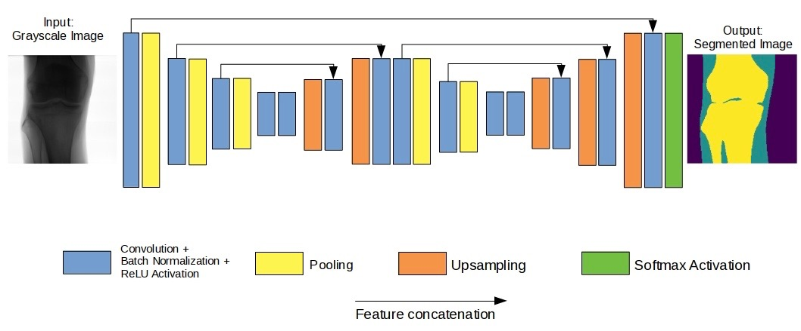

# XNet

**Note:** If you're at the SPIE Medical Imaging Conference you can try out our demo at this link:

[Demo notebook](https://mybinder.org/v2/gh/JosephPB/XNet/master) and launch the ```Training demo.ipynb``` notebook

XNet is an open-source tool desinged to for segmenting medical X-Ray images into bone, soft tissue and open beam regions. We provide an end-to-end implementation of our original Convolutional Neural Network, including pre-processing and post-processing stages. Specifically, XNet performs well on small datasets with the aim to minimise the number of false positives in the soft tissue class.

## Usage



XNet is a neural network based algorithm and requires training on a labelled dataset. The algorithm was designed to only require a small amount of training data (around 150 images), a size deemed manageable by a medical institution.

Information on how to train the network from scratch is given in the ```Training demo.ipynb``` notebook.

For more infomration on the architecture of the network see the ```XNet.py``` file.

## Examples

XNet outputs a mask of equal size to the input images and has been tested on a variety of bodypars.


## Data

When training our network for inference, we used the following data:

* 150 X-Ray images.

* No scatter correction.

* 1500x1500 ```.tif``` images downsampled to 200x200 pixels

* 20 human body part classes.

As this work grew out of work with a corporation we are sadly unable to share the propriatory data we used.

## Benchmarking

XNet was benchmarked against two of the leading segmentation networks:

* Simplified [SegNet](https://arxiv.org/abs/1511.00561) (found in the
  ```SimpleSegNet.py``` file)

* [UNet](https://arxiv.org/abs/1505.04597) (found in the ```UNet.py```
  file)

We outperfom both networks on our dataset.

## More information

The paper presenting XNet has been accepted for presentation at the 2019 SPIE Medical Imaging conference and will be presented in February. The paper is published on the preprint database: [arXiv](https://arxiv.org/abs/1812.00548). Additioanlly, the conference poster can be found in ```poster.pdf```.

Please note that some of the path variables may need to be corrected in order to utilise the current filing system. These are planned to be updated in the future.
